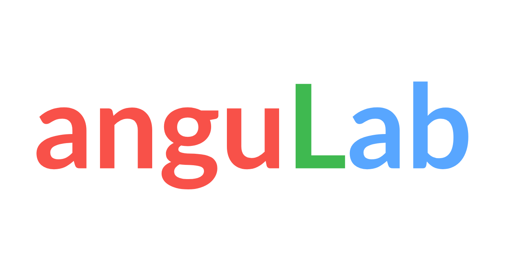

# AnguLab15

> A [sample project repository](https://github.com/AlbertoBasalo/angulab15/) for Angular15 workshop demos

## Instructions to execute

- ➿ Clone this repo

- 🚚 Install dependencies `npm i`

- 🏭 Build the Home Lib `npm run build home`.

- 🚀 Execute `npm start` to run the main App.

- 📕 Read the [`docs`](./docs/) folder content for more info.

- 🍳 There are a [CLI journal](./docs/CLI.md) with all the run commands.

---

## Workspace scaffolding

- 📂 projects
  - 📂apps
    - 🌐 www
  - 📂 routes
    - 🗺️ home

---

<footer>
  <h3>🧑🏼‍💻 By <a href="https://albertobasalo.dev" target="blank">Alberto Basalo</a> </h3>
  

    
  

  

    
  

</footer>
